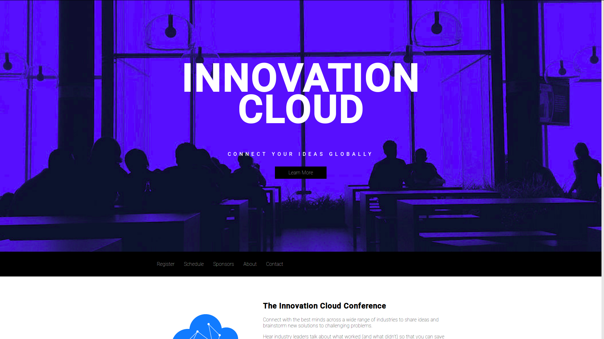

This is a Front-end project using HTML, CSS and Bootstrap. The main reason for doing this project is to work with the core concepts of the Front-end Web Development.

Here you'll find how to put a background-image propertly, how to syle your page, buttons. Also, have good examples of button's style and a navbar. Feel free to use this template in your own project or to message me if you want some aditional information

 If you want to see this Front-end project online, you can find it in my <a href="http://codepen.io/LuKrebs/full/gmZjJW/">CodePen profile</a>.

The image below give us an idea about what this project looks like: 

